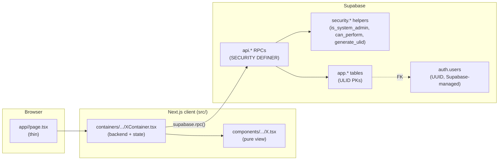
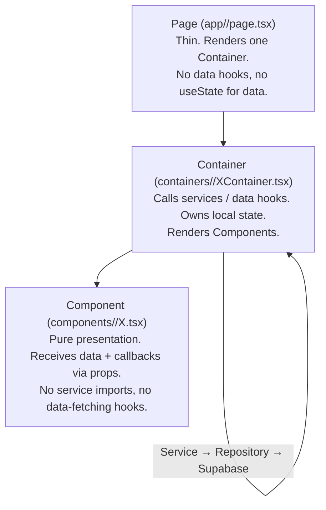
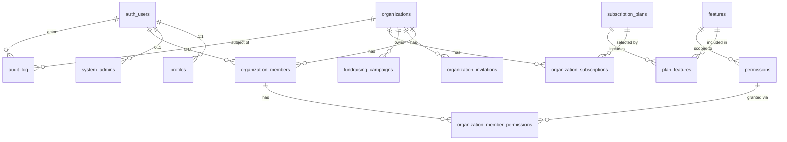
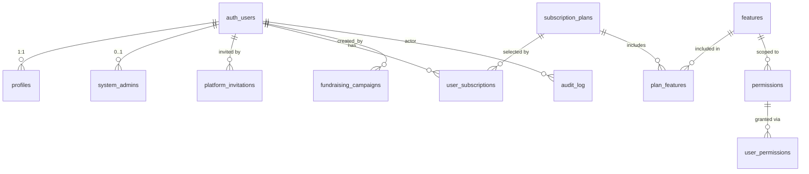
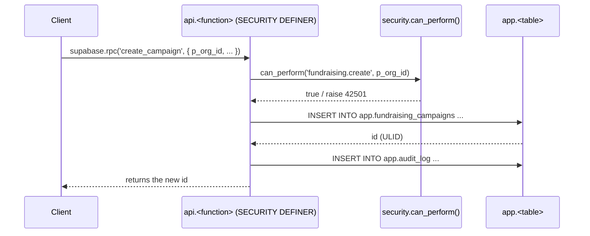
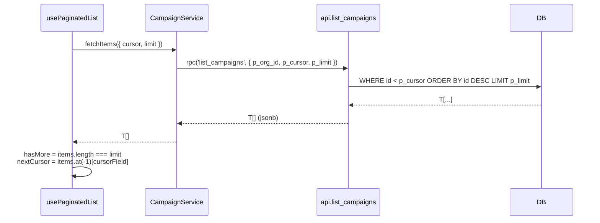

# Architecture

This template ships a Next.js frontend and a Supabase backend (Postgres + Auth + RLS) wired through a single architectural contract: **a strict three-layer frontend, a function-first API schema, and a ULID-keyed application schema**.

## High-level request flow

## Frontend layering

The contract in `AGENTS.md` is the source of truth. Three layers, one job each:

A Container may render many Components, but a Component must never render a Container or call a Service.

## Database schemas

The database is partitioned into four schemas. Each has a single job:

```mermaid
flowchart LR
  subgraph Public["public / extensions"]
    Pgcrypto["pgcrypto<br/>(gen_random_bytes)"]
  end
  subgraph Auth["auth (Supabase-managed)"]
    AuthUsers["auth.users<br/>(UUID id)"]
  end
  subgraph Security["security (template-owned)"]
    GenULID["generate_ulid()"]
    TokenDigest["token_digest()"]
    IsSysAdmin["is_system_admin()"]
    HasRole["has_role_in_active_org()"]
    CanPerform["can_perform(p_permission, p_org_id)"]
  end
  subgraph App["app (template-owned, ULID PKs)"]
    Org["organizations"]
    Members["organization_members"]
    Invites["organization_invitations"]
    Subs["organization_subscriptions"]
    Plans["subscription_plans"]
    Features["features"]
    Perms["permissions"]
    PlanFeat["plan_features"]
    Campaigns["fundraising_campaigns"]
    SysAdmins["system_admins"]
    Audit["audit_log"]
  end
  subgraph API["api (template-owned, SECURITY DEFINER RPCs)"]
    OrgRPCs["request_organization, approve_organization, ..."]
    MemberRPCs["invite_member, change_member_role, get_organization_members, ..."]
    CampaignRPCs["create_campaign, list_campaigns, ..."]
    PlanRPCs["list_plans, create_plan, set_plan_feature, ..."]
  end

  Security --> Pgcrypto
  App --> Auth
  API --> Security
  API --> App
```

| Schema | Owner | Job | Trust boundary |
|---|---|---|---|
| `auth` | Supabase | Identity (users, sessions) | Never modified by template migrations |
| `app` | Template | Persistent state (tables) | RLS + grant-restricted |
| `security` | Template | Auth primitives (ULID, role checks) | `SECURITY DEFINER`, run as owner |
| `api` | Template | Single entry point for client (`rpc()`) | `SECURITY DEFINER`, run as owner; client code calls only these |

## Data model (main branch, organization-centric)

Notes:
- All `app.*` tables use **ULID text** primary keys (26-char Crockford Base32, time-sortable).
- `auth.users.id` is **UUID** (Supabase-managed). FK columns that reference it stay `uuid`.
- `active_organization_id` and `audit_log.entity_id` are `text` (reference ULID tables).
- `profiles.id` is UUID (1:1 with `auth.users`).

## Data model (feat/user-centric-app)

Same diagram minus the org layer:

## Authorization path

Every API RPC follows the same gate:

`can_perform` resolves a permission code in this order:
1. Is the caller a system admin? → allow.
2. Does the user hold the explicit permission in `organization_member_permissions`? → allow.
3. Does the org's active subscription include the feature mapped to this permission? → allow.
4. Otherwise → raise `42501 insufficient_privilege`.

## Pagination contract

Both branches use the same shape: SQL returns a flat JSONB array, the frontend hook derives `hasMore` and the next cursor.

- `cursorField` defaults to `'id'` on main, `'created_at'` on user-centric (where it sorts campaigns by recency for now).
- ULID is time-sortable, so `WHERE id < p_cursor` + `ORDER BY id DESC` is consistent for all ULID-keyed tables.
- For `auth.users`-backed listings (`list_all_users`), the cursor is the `created_at` timestamp cast through `p_cursor::timestamptz`.

## Feature scaffolder

`./scripts/setup.sh feature <name>` generates six files from templates, sed-replacing `{{PASCAL}}`, `{{SNAKE}}`, `{{PLURAL}}`. See `docs/adding-a-feature.md` for the full walkthrough.
